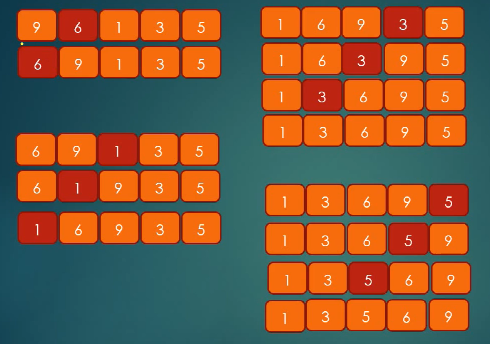

## 1. 时间复杂度


### 1.1 稳定性

通俗地讲就是能保证排序前两个相等的数据其在序列中的先后位置顺序与排序后它们两个先后位置顺序相同。即：如，如果A i == A j，Ai 原来在 Aj 位置前，排序后 Ai  仍然是在 Aj 位置前。

### 1.2 稳定的排序算法

冒泡排序、插入排序、归并排序和基数排序

### 1.3 非稳定的排序算法

选择排序、快速排序、希尔排序、堆排序

### 1.4 排序算法稳定性的意义

（1）如果排序算法是稳定的，那么从一个键上排序，然后再从另一个键上排序，第一个键排序的结果可以为第二个键排序所利用。基数排序就是这样，先按低位排序，逐次按高位排序，那么，低位相同的数据元素其先后位置顺序即使在高位也相同时是不会改变的。

（2）学习排序原理时，可能编的程序里面要排序的元素都是简单类型，实际上真正应用时，可能是对一个复杂类型（自定义类型）的数组排序，而排序的键值仅仅只是这个元素中的一个属性，对于一个简单类型，数字值就是其全部意义，即使交换了也看不出什么不同。

    但是，对于复杂类型，交换的话可能就会使原本不应该交换的元素交换了。比如：一个“学生”数组，欲按照年龄排序，“学生”这个对象不仅含有“年龄”，还有其它很多属性。假使原数组是把学号作为主键由小到大进行的数据整理。而稳定的排序会保证比较时，如果两个学生年龄相同，一定不会交换。也就意味着尽管是对“年龄”进行了排序，但是学号顺序仍然是由小到大的要求。

（3）如果排序算法稳定，对基于比较的排序算法而言，元素交换的次数可能相对会少一些。 

###1.5 各种排序算法稳定性分析

（1）冒泡排序：稳定

     冒泡排序就是把小的元素往前调（或者把大的元素往后调）。注意是相邻的两个元素进行比较，而且是否需要交换也发生在这两个元素之间。所以，如果两个元素相等，我想你是不会再无聊地把它们俩再交换一下。如果两个相等的元素没有相邻，那么即使通过前面的两两交换把两个元素相邻起来，最终也不会交换它俩的位置，所以相同元素经过排序后顺序并没有改变。

（2）选择排序：不稳定

      选择排序即是给每个位置选择待排序元素中当前最小的元素。比如给第一个位置选择最小的，在剩余元素里面给第二个位置选择次小的，依次类推，直到第n-1个元素，第n个元素不用选择了，因为只剩下它一个最大的元素了。那么，在选择时，如果当前锁定元素比后面一个元素大，而后面较小的那个元素又出现在一个与当前锁定元素相等的元素后面，那么交换后位置顺序显然改变了。

      举个例子：序列5 8 5 2 9， 我们知道第一趟选择第1个元素5会与2进行交换，那么原序列中两个5的相对先后顺序也就被破坏了。 

（3）插入排序：稳定

      插入排序是在一个已经有序的小序列的基础上，一次插入一个元素。当然，刚开始这个有序的小序列只有1个元素，也就是第一个元素（默认它有序）。

比较是从有序序列的末尾开始，也就是把待插入的元素和已经有序的最大者开始比起，如果比它大则直接插入在其后面。否则一直往前找直到找到它该插入的位置。如果遇见一个与插入元素相等的，那么把待插入的元素放在相等元素的后面。

      所以，相等元素的前后顺序没有改变，从原无序序列出去的顺序仍是排好序后的顺序，所以插入排序是稳定的。 

（4）快速排序：不稳定

      快速排序有两个方向，左边的i下标一直往右走（当条件a[i] <= a[center_index]时），其中center_index是中枢元素的数组下标，一般取为数组第0个元素。

而右边的j下标一直往左走（当a[j] > a[center_index]时）。如果i和j都走不动了，i <= j, 交换a[i]和a[j],重复上面的过程，直到i>j。交换a[j]和a[center_index]，完成一趟快速排序。

      在中枢元素和a[j]交换的时候，很有可能把前面的元素的稳定性打乱，比如序列为 5 3 3 4 3 8 9 10 11 ，现在中枢元素5和3(第5个元素，下标从1开始计)交换就会把元素3的稳定性打乱。

      所以快速排序是一个不稳定的排序算法，不稳定发生在中枢元素和a[j]交换的时刻。 

（5）归并排序：稳定

      归并排序是把序列递归地分成短序列，递归出口是短序列只有1个元素(认为直接有序)或者2个序列(1次比较和交换)，然后把各个有序的段序列合并成一个有序的长序列，不断合并直到原序列全部排好序。可以发现，在1个或2个元素时，1个元素不会交换，2个元素如果大小相等也没有人故意交换，这不会破坏稳定性。那么，在短的有序序列合并的过程中，稳定是是否受到破坏？没有，合并过程中我们可以保证如果两个当前元素相等时，我们把处在前面的序列的元素保存在结果序列的前面，这样就保证了稳定性。 

（6）基数排序：稳定

      基数排序是按照低位先排序，然后收集；再按照高位排序，然后再收集；依次类推，直到最高位。

有时候有些属性是有优先级顺序的，先按低优先级排序，再按高优先级排序，最后的次序结果就是高优先级高的在前，高优先级相同的情况下低优先级高的在前。

      基数排序基于分别排序，分别收集，所以其是稳定的排序算法。

（7）希尔排序：不稳定

      希尔排序是按照不同步长对元素进行插入排序，当刚开始元素很无序的时候，步长最大，所以插入排序的元素个数很少，速度很快；当元素基本有序时，步长很小，插入排序对于有序的序列效率很高。所以，希尔排序的时间复杂度会比O(N^2)好一些。由于多次插入排序，我们知道一次插入排序是稳定的，不会改变相同元素的相对顺序，但在不同的插入排序过程中，相同的元素可能在各自的插入排序中移动，最后其稳定性就会被打乱。

（8）堆排序：不稳定

      我们知道堆的结构是节点i的孩子为2*i和2*i+1节点，大顶堆要求父节点大于等于其2个子节点，小顶堆要求父节点小于等于其2个子节点。在一个长为n的序列，堆排序的过程是从第n/2开始和其子节点共3个值选择最大（大顶堆）或者最小（小顶堆），这3个元素之间的选择当然不会破坏稳定性。

但当为n/2-1, n/2-2, ...1这些个父节点选择元素时，就会破坏稳定性。有可能第n/2个父节点交换把后面一个元素交换过去了，而第n/2-1个父节点把后面一个相同的元素没有交换，那么这2个相同的元素之间的稳定性就被破坏了。

## 2. 基本数据结构

### 2.1. 冒泡排序

### 2.2. 选择排序

### 2.3. 插入排序

描述:

插入排序，一般也被称为直接插入排序。对于少量元素的排序，它是一个有效的算法 [1]  。插入排序是一种最简单的排序方法，它的基本思想是将一个记录插入到已经排好序的有序表中，从而一个新的、记录数增1的有序表。在其实现过程使用双层循环，外层循环对除了第一个元素之外的所有元素，内层循环对当前元素前面有序表进行待插入位置查找，并进行移动 [2]  。

解题思路:



**1.反转链表**

假设存在链表 1 → 2 → 3 → Ø，我们想要把它改成 Ø ← 1 ← 2
← 3。 

**迭代**

在遍历列表时，将当前节点的 next
指针改为指向前一个元素。由于节点没有引用其上一个节点，因此必须事先存储其前一个元素。在更改引用之前，还需要另一个指针来存储下一个节点。不要忘记在最后返回新的头引用！
```java
public ListNode reverseList(ListNode head) {
    ListNode prev = null;
    ListNode curr = head;
    while (curr != null) {
        ListNode nextTemp = curr.next;
        curr.next = prev;
        prev = curr;
        curr = nextTemp;
    }
    return prev;
}
``` 

复杂度分析 

时间复杂度：O(n)，假设 n 是列表的长度，时间复杂度是 O(n)。
空间复杂度：O(1)。


**递归**

递归版本稍微复杂一些，其关键在于反向工作。假设列表的其余部分已经被反转，现在我该如何反转它前面的部分？

假设列表为：

n1\... \ n_{k-1} \ n_{k} \ n_{k+1} \... \ n_{m} \ →∅

若从节点 n_{k+1} 到 n_{m}已经被反转，而我们正处于 n_{k}。

n_{1}\ ... \ n_{k-1} \ n_{k} \ n_{k+1} \... \n_{m}

我们希望 n_{k+1}​ 的下一个节点指向 n_{k}。

所以，n_{k}.next.next = n_{k}。

要小心的是 n_{1}的下一个必须指向
Ø。如果你忽略了这一点，你的链表中可能会产生循环。如果使用大小为 2
的链表测试代码，则可能会捕获此错误。

```java
public ListNode reverseList(ListNode head) {
    if (head == null || head.next == null) return head;
    ListNode p = reverseList(head.next);
    head.next.next = head;
    head.next = null;
    return p;
}
```
复杂度分析

时间复杂度：O(n)，假设 n 是列表的长度，那么时间复杂度为 O(n)。
空间复杂度：O(n)，由于使用递归，将会使用隐式栈空间。递归深度可能会达到 n
层。
